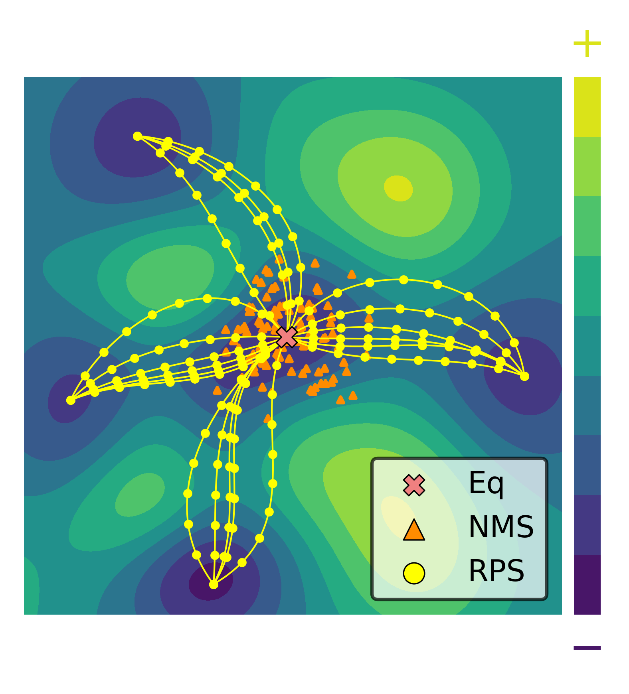
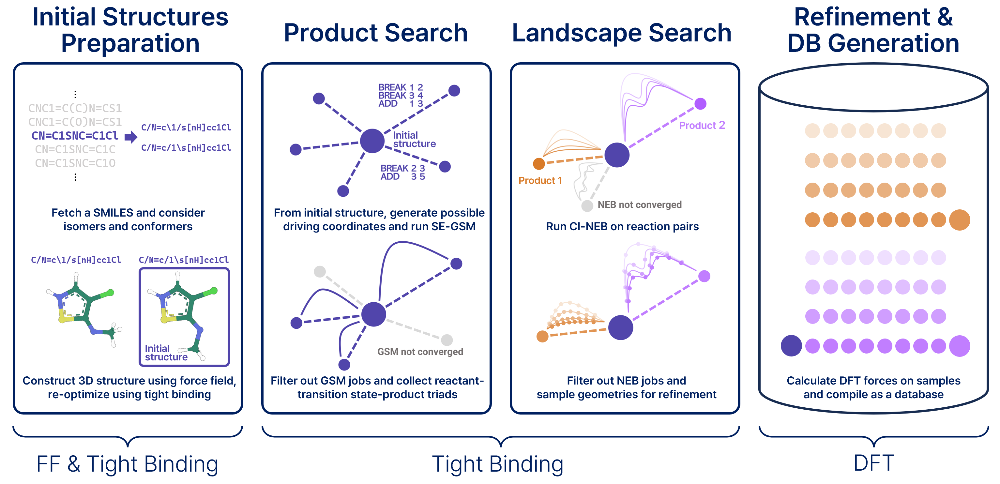

# Welcome to Dandelion

This is the documentation site of Dandelion

  

# Introduction

Dandelion is a program that aims to improve Machine Learning Interatomic Potentials(MLIP) by sampling the Potential Energy Surface(PES) of molecules effectively. To sample structures efficiently, our approach selectively employs ab initio calculations after using tight-binding method. This allows for building expanded database beyond equilibrium states. This documentation is to provide a guide for installation, setup and several examples to use.

  

## Git repository
<https://github.com/jjy1031/jjy1031.github.io>
