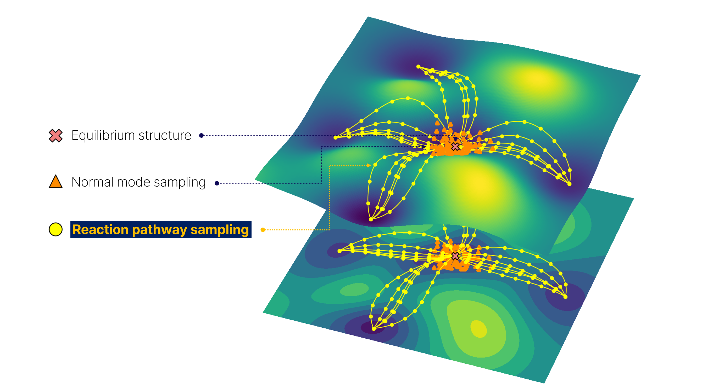

# Dandelion Docs
Welcome to the documentation site of Dandelion.

  

# Introduction
Dandelion is a program designed to build expanded database beyond equilibrium states by  effectively sampling the Potential Energy Surface(PES) of molecules. This approach can provide sufficient dataset for training networks, and enhance the performance of Machine Learning Interatomic Potentials(MLIPs). To sample chemical space efficiently, our method selectively employs ab initio calculations after using tight-binding method. For required high-level calculation, we use ORCA, the external quantum chemistry program. This documentation aims to provide a guide for installation, setup and several examples to use Dandelion. 

## Git repository
<https://github.com/mhyeok1/dand/>
