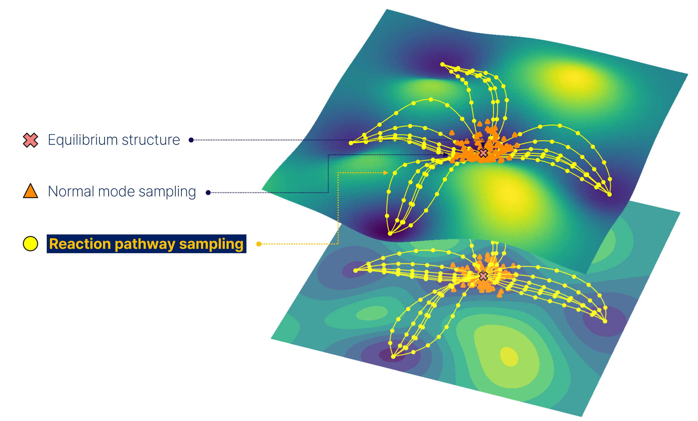

# Dandelion Docs
Welcome to the documentation site of Dandelion.

  

# Introduction

 
Dandelion is a code designed to build comprehensive chemical databases by efficiently sampling reactive chemical space. Our approach combines fast tight-binding calculations with selective high-level refinement to generate high-quality datasets for Machine Learning Interatomic Potentials (MLIPs). The workflow consists of four phases:

1. **Reactant Preparation**: Generate diverse 3D structures from GDB-13 database
2. **Product Search**: Find reaction pathways using single-ended growing string method
3. **Landscape Search**: Sample transition states using nudged elastic band method
4. **Refinement**: Perform high-level DFT calculations using ORCA

This documentation guides the installation, setup, and usage of Dandelion.

## Git repository
<https://github.com/mhyeok1/dand/>
